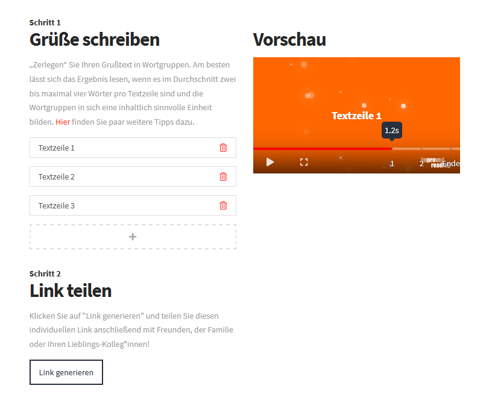

Animated Greetings
======


"Animated Greetings" is a WordPress plugin to create beautiful and animated greeting message
that can be shared via various social media sites and messengers.

Official git repository: https://github.com/JulianVallee/animated-greetings

Features
========

- Write your own greeting messages (supports text + unicode smileys)
- Set animation and styles per line of text
- Set an animation background effect
- Set an animation theme
- Create a short link to share greetings
- Share the link via various social media sites and messengers



Instructions
============

Lorem Ipsum dolor sit amet.


```
[animated-greetings]
```


News
===

### 2021-12-31

New Years Update!

- Improve player performance on low-end devices

### 2021-12-12

Initial release


Compatibility Status
========
| Platform | Status         |
|----------| -------------- |
| Chrome   |  |
| Edge     |  |
| Firefox  |  |
| IE11     |  |
| Safari   |  |


Documentation
========
| Type                    | Link |
|-------------------------|------|
| User Documentation      |      |
| Developer Documentation |      |


Todo
========
- [ ] Separate Animated Greetings into JS library and WordPress Plugin
- [ ] Improve documentation